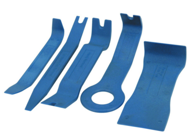

The exterior door handles on the Classic can break in various spots. The entire
unit(lock, handle, etc) can be replaced, but it doesn't need to be and thats
expensive! Here are directions how to swap out the handle and re-used the
original lock and mechanism.  I'm not
sure where this PDF came from, but whoever created it, thank you!

[Replacing door lever](./door-handle-repacement-pin-instructions.pdf)

I've used the [pin removal method(pdf)](./door-handle-repacement-pin-instructions.pdf)
to swap out a broken silver RRC lever and replaced it with a black Disco lever.  

After putting everything back together, I found the the exterior black trim around
the handle didn't lie flat against the body panel. It appeared not to seal well.
Since it's always raining here in Oregon, I sealed up the trim piece with a bit
of RTV sealant - the cheap stuff - to keep out the water.

Harbor Freight sells a [Trim And Molding Tool Set 5 Pc](http://www.harborfreight.com/5-piece-auto-trim-and-molding-tool-set-67021.html)
that makes the job of removing the inside door panels alot easier.

