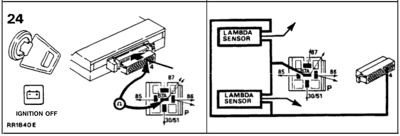

### What is a Lambda sensor?

The 3.9L ECU uses a particular type of O2 sensor with a ceramic element made
from "titania" or titanium dioxide. This is not a very commone O2 sensor.
Aftermarket generics are available, but require changing the sensors wiring
connector. Not too difficult.

Read more about oxygen sensor types here: https://en.wikipedia.org/wiki/Oxygen_sensor

**Definition** _Range Rover Manual, Section 19, page 3:_

> LAMBDA SENSORS (O2 SENSORS) 
>
> The two Lambda sensors are located forward of the catalysts mounted in the
> exhaust downpipes.  The sensors monitor the oxygen content of the exhaust
> gases and provide feedback information of the air/fuel ratio to the E.C.U.
> Each sensor is heated by an electrical element to improve its response time
> when the ignition is switched on.

### Test Procedure
_Range Rover Manual, Section 19, page 23_

image24. 
Check Lambda sensor heater coils 
NOTE: Remove pump relay from its conneclor

RESULTS . Check cables and units shown in bold
Ohm-meter reading of 2.65-3.35 Ohms

Incorrect reading
Check:
NOTE: A reading of 5.3 to 6.7 Ohms indicates a faulty Lambda sensor

### Replacement

This [post](
http://www.rangerovers.net/forum/8-range-rover-classic/126706-installed-standard-motor-products-sg130-o2-sensors-16-each-my-95-lwb.html#post900306)
originally talks about a 4.2L 1995 Classic. I'm not sure if the 3.9L motor uses
the same O2 sensors.

This [reply]( http://www.rangerovers.net/forum/8-range-rover-classic/126706-installed-standard-motor-products-sg130-o2-sensors-16-each-my-95-lwb.html#post999114)
(quoted below) mentions using the sensors. The vehicle isn't mentioned in the quote, but in
the signature, as a 1994 RRC.

> Re: Installed Standard Motor Products SG130 O2 sensors $16 each on my 95 LWB
>
> Yep, I installed 2 different titania sensors on mine after I replaced the cats. One was a Nissan replacement, the other was without a connector. Soldered my connectors on with new heat shrink, you can't even tell they're not OEM now. In fact, in taking apart the OEMs, they are all just crimped and soldered together to mate the common O2 sensor to whatever connector the drawing requires. They were both NGK's, $42 for both delivered. I scrounged around for a while to find those. Some PNs you can look for:
> 
> Airtex 5S3787 and cross reference parts: 2269061A00, 2269061A10, 2269061A20, 2269067S00, 2269069A01, SU4491 
> 
> SMP SG130 and cross reference parts: #2269019P20, 2269019P40, 2269021P00, 2269028F20, 2269061A00, 2269061A01, 2269070F00, 2269070F10, 226A01M500, 226A01M560, 226A070F00, 226A070F10, 226A070F65, SG233, SG538
> 
> Source: RockAuto.com
> 
> Mine went to a 1987 NISSAN SENTRA 1.6L L4.

Another resource talking about using the Nissan sensors: http://www.rovermechanic.com/rr/Emissions/O2Sensor/

### Where to Buy

 * [Amazon](http://www.amazon.com/Evan-Fischer-EVA14672052433-Designed-compatible-flanges/dp/B009DJQS8M/ref=sr_1_3?s=automotive&ie=UTF8&qid=1451236741&vehicle=1992-11-50-136--9-6-8-5599-99-1-2-485-187-2-0&sr=1-3&ymm=1992%3Aland+rover%3Arange+rover&keywords=oxygen+sensor)
 indicates this sensor will fit with splicing. $21.77
 * [Atlantic British](http://www.roverparts.com/Parts/ERR6729) Fits 3.5l, 3.9l and 4.2l. On sale for $99.95
 * [Rock Auto](https://www.rockauto.com/catalog/moreinfo.php?pk=279302&cc=1368637&jnid=574&jpid=8) BOSCH 13021 OE Style Oxygen Sensor; Titania; Wires: 3, Requires splicing $46.79
 * [Rock Auto](https://www.rockauto.com/catalog/moreinfo.php?pk=976497&cc=1187186&jnid=424&jpid=3) BOSCH 13946 OE Style Oxygen Sensor; Titania; Wires: 3 $97.89
 * [Rock Auto](https://www.rockauto.com/catalog/moreinfo.php?pk=5827206&cc=1187186&jnid=424&jpid=4) NTK OTD3G3A1 3 x wire Titania sensor; From Chassis: JA61294 $107.79

### Math

An interesting article about how the O2 sensor works(PDF): 
[Lambda Calculation – The Brettschneider Equation, general principles and methods](./lambda-calc-o2-sensor-white-paper.pdf)
