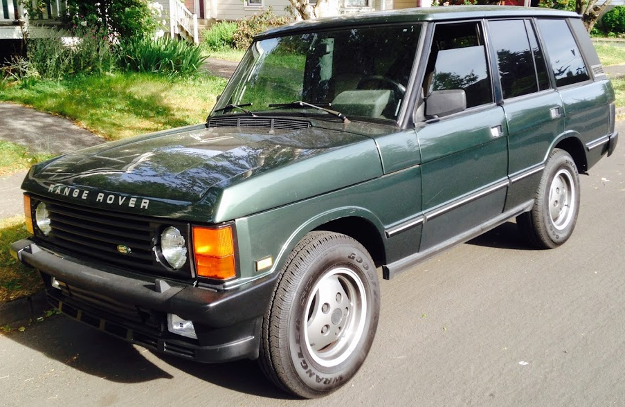
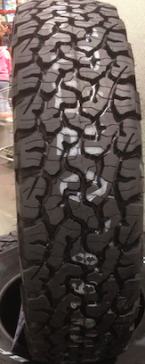

My current tire size: P225/75R16



I like the tall, narrow tire look on the RRC. A tire with added sidewall
support to allow for tire deflation when off road would be nice.  The BFG AT
235/85R16 looks good, but I might lean towards a 225 or a 215 width.  Costco
has a good deal on [BFG All Terrain TA KO2 LT235/85R16](http://costco.com) for
$174.99.





Likely the best resource for RRC tire information: http://www.rangerovers.net/outfitting/tires/classictires.html

From RangeRovers.net: "215/85 R16 
This size requires no body, suspension or even steering stop modifications.
Interestingly, dimensions are almost identical to the 700-16's used on Camel
Trophy vehicles for many years, and the width is similar to the stock Range
Rover tires. It yields close to an inch of extra static clearance under the
diffs, with a slight gearing penalty of 3-4% at highway speeds."

---

Tire notes from: http://www.landroversonly.com/forums/f42/basic-tire-information-6885/

Discovery 1 tire sizes are similar to those of the Range Rover Classic.

```
Discovery I 94-99 


<29"

205/80/16: Stock size in other countries. same height as 235/70-16. 

235/70/16: Stock tire size. 

255/65/16: same height as stock but wider

225/75/16: same height as stock but narrower

245/70/16: a little taller and wider than the stock size


30"-31"

255/70/16: slightly taller and wider than stock, but still fits with no lift.

245/75/16: fits on stock height but popular size for 2" lifts. some trimming on
the rear wheel well and adjustment on the steering stops. 

215/85/16: same height as 245/75/16 but narrower. 

265/70/16: about as tall as 245/75/16 but wider.


32"

265/75/16: Same as stock Defender tires. Will require some more trimming. lift
highly recommended.

235/85/16: same height as 265/75/16 but narrower. 


33"

255/85/16: about 33". a lot more trimming required and you should consider
upgrading to hd axles.

285/75/16: also about 33" but wider. a lot more trimming required and you
should consider upgrading to hd axles. offset whdeels recommended.

```
